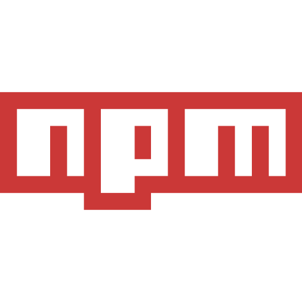
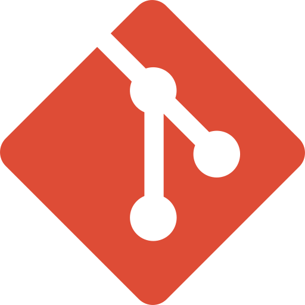

# Hi there , I'm [Sanket Shah](https://sanketshah19.github.io/) <image src="https://raw.githubusercontent.com/TheDudeThatCode/TheDudeThatCode/master/Assets/Developer.gif" width="40">

I'm a Skilled React Developer with programmatic approach towards the solution of complex problems with an ability to conceptualize, design and develop scalable web application with a touch of innovation. Loves to build products, solve problems and bridge the gap using different technologies. Willing to explore new technologies, learn and try to be a better programmer each single day.

## Find me around the web 

  
    <a href="https://www.linkedin.com/in/sanketshah19/">
       &nbsp;
    </a>
  
  
    <a href="mailto:sanketshah17.ss@gmail.com">
       &nbsp;
    </a>
  
  
    <a href="https://sanketshah19.github.io/">
       &nbsp;
    </a>
  
  
    <a href="https://twitter.com/_Sanket_Shah_">
       &nbsp;
    </a>
  
  
    <a href="https://www.instagram.com/_sanket_shah_/">
       &nbsp;
    </a>
  
  
    <a href="https://sanket-shah.medium.com">
       &nbsp;
    </a>
  

  
    
  

## Things I deal with on the computer <image src="https://raw.githubusercontent.com/TheDudeThatCode/TheDudeThatCode/master/Assets/Designer.gif" width="45">

  
     &nbsp; &nbsp; &nbsp;
  
  
     &nbsp; &nbsp; &nbsp;
  
   
     &nbsp; &nbsp; &nbsp;
  
   
     &nbsp; &nbsp; &nbsp;
  
  
     &nbsp; &nbsp; &nbsp;
  
  
     &nbsp; &nbsp; &nbsp;
  
  
     &nbsp; &nbsp; &nbsp;
  
  
     &nbsp; &nbsp; &nbsp;
  
  
     &nbsp; &nbsp; &nbsp;
  

## GitHub Stats 📊

  

  

## Support Me 💖

If you find my work good, consider giving it :star: or fork-ing to show some :heart:.

<!-- Octocat Creator: https://opensea.io/inshh988 -->
